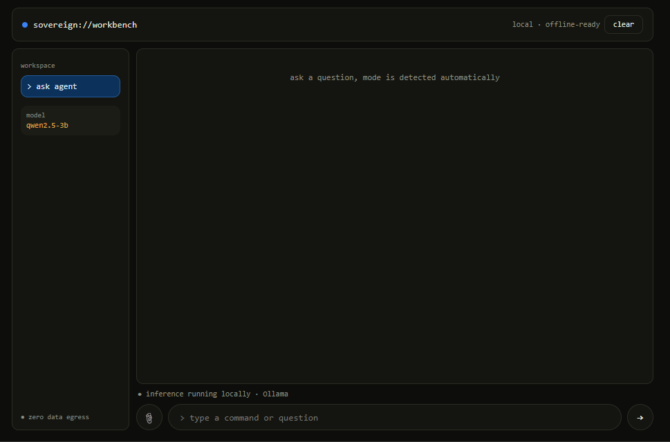
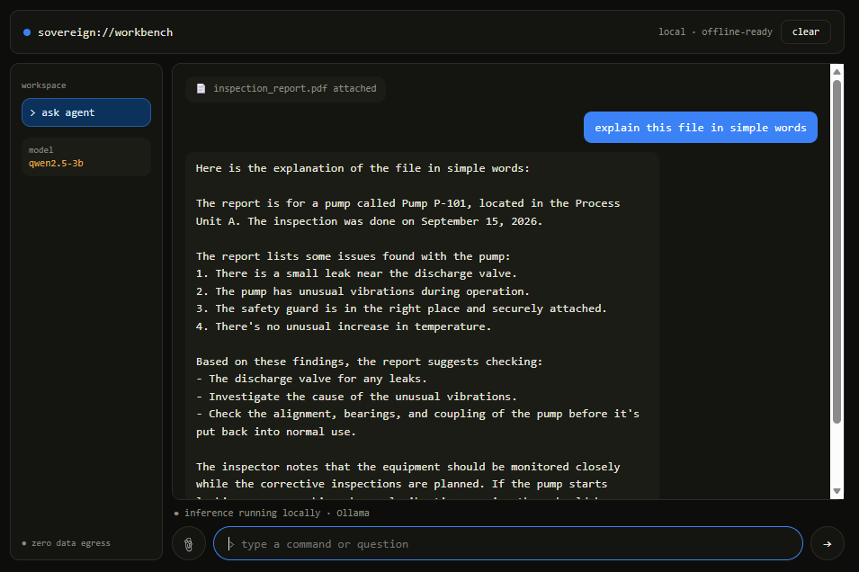
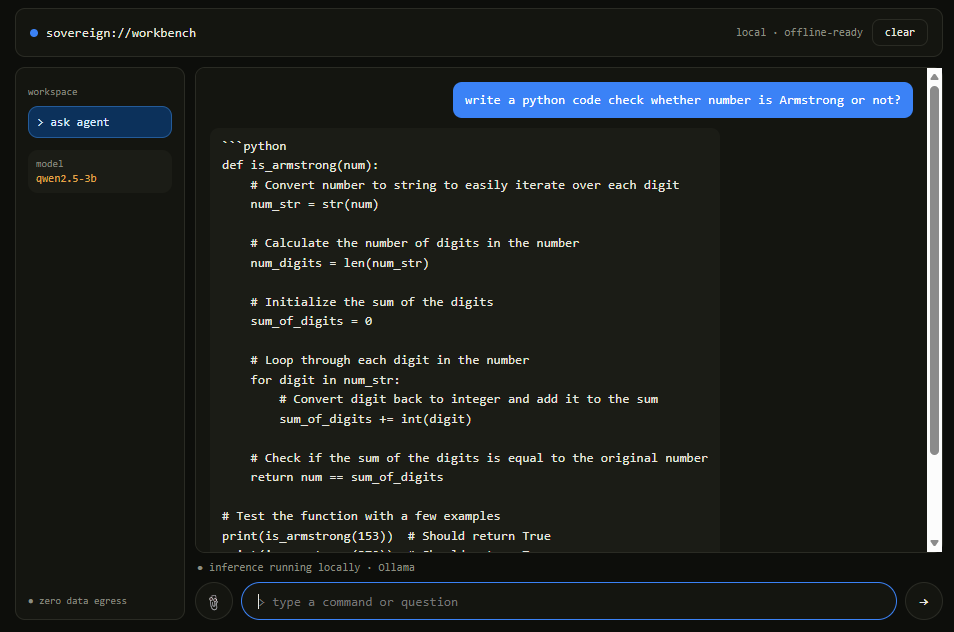

# ASK — Sovereign Agentic AI Workbench

A private, local-first agentic AI workbench that handles general questions, documents, code, and images through a single interface.


## Overview

**ASK (Agentic Sovereign Knowledge)** is a local AI workbench. It classifies each request and routes it to the right workflow: general Q&A, document analysis, Python coding, or image understanding. All inference runs on locally hosted open-weight models through Ollama, so sensitive data does not need to leave your machine.

## Table of Contents

- [Features](#features)
- [Demo / Screenshots](#demo--screenshots)
- [Architecture](#architecture)
- [Tech Stack](#tech-stack)
- [Getting Started](#getting-started)
- [Usage](#usage)
- [Project Structure](#project-structure)
- [Privacy and Security](#privacy-and-security)
- [Roadmap](#roadmap)
- [Contributing](#contributing)
- [Contact](#contact)

## Features

- **Automatic task routing:** Classifies each request as General, Document, Coding, or Image. You use one agent instead of switching tools.
- **Local LLM inference:** Runs Qwen 2.5 models (`qwen2.5:1.5b` and `qwen2.5:3b`) through Ollama. No remote LLM API is required.
- **Document understanding:** Extracts text from PDF, DOCX and TXT files, retrieves relevant passages, and answers questions locally.
- **Image understanding via OCR:** Extracts text from images with Tesseract and passes it to the local model.
- **Coding assistant:** Generates Python code and supports a local execution workflow through a sandbox tool.
- **Modular design:** Tools live in separate modules, so you can add new tools and routes.

## Demo / Screenshots

Live demo: none yet.

### Main interface


### Document question answering


### Coding workflow


## Architecture

```text
                    ┌─────────────────────┐
                    │       Web UI        │
                    │    Local Browser    │
                    └──────────┬──────────┘
                               │
                               ▼
                    ┌─────────────────────┐
                    │      Flask API      │
                    │      ASK Agent      │
                    └──────────┬──────────┘
                               │
                               ▼
                    ┌─────────────────────┐
                    │     Task Router     │
                    │  General | Document │
                    │  Coding  | Image    │
                    └──────────┬──────────┘
                               │
              ┌────────────────┼────────────────┐
              │                │                │
              ▼                ▼                ▼
        ┌──────────┐     ┌──────────┐    ┌──────────┐
        │ Document │     │  Coding  │    │   OCR    │
        │  Tools   │     │ Sandbox  │    │  Tools   │
        └────┬─────┘     └──────────┘    └────┬─────┘
             │                                │
             └────────────────┬───────────────┘
                              ▼
                    ┌─────────────────────┐
                    │       Ollama        │
                    │  Local Qwen Models  │
                    └─────────────────────┘
```

### Routing

| Request type | Route |
|---|---|
| General questions | General |
| PDF / document questions | Document |
| Python programming requests | Coding |
| Image-based questions | Image |

## Tech Stack

| Component | Technology |
|---|---|
| Backend | Flask |
| Local LLM runtime | Ollama |
| LLMs | Qwen 2.5 |
| Language | Python 3.13.5 |
| Document processing | PyPDF, python-docx |
| OCR | Tesseract, pytesseract |
| Image processing | Pillow |
| Embeddings | Sentence Transformers |
| Vector search | FAISS |
| Code execution | Python sandbox |
| Frontend | HTML, CSS, JavaScript |

## Getting Started

### Prerequisites

- Python 3.13.5
- [Ollama](https://ollama.com) installed and running
- At least one supported local model (see installation step 5)
- Tesseract OCR engine installed on your system (required by `pytesseract` for the image workflow)
- `git`

### Installation

1. Clone the repository.

```bash
   git clone https://github.com/raman-codesX/Sovereign-Agentic-AI-Workbench.git
   cd Sovereign-Agentic-AI-Workbench
```

2. Create a virtual environment.

```bash
   python -m venv venv
```

3. Activate it.

   Windows:

```bash
   venv\Scripts\activate
```

   macOS / Linux:

```bash
   source venv/bin/activate
```

4. Install dependencies.

```bash
   pip install -r requirements.txt
```

5. Pull the local models.

```bash
   ollama pull qwen2.5:3b
   ollama pull qwen2.5:1.5b
```

### Run

Make sure Ollama is running, then start the app:

```bash
python app.py
```

Open [http://127.0.0.1:5000](http://127.0.0.1:5000) in your browser.

## Usage

### General

```text
User:  What is artificial intelligence?
ASK:   General route → local Qwen model → answer
```

### Document

```text
User:  [Attach PDF] What is this document about?
ASK:   Document route → extract text → retrieve relevant content → generate answer locally
```

### Coding

```text
User:  Write Python code to check whether a number is prime.
ASK:   Coding route → generate Python code → coding workflow → return answer
```

### Image

```text
User:  [Attach image] What does this image mean?
ASK:   Image route → OCR → local AI processing → answer
```

## Project Structure

```text
Sovereign-Agentic-AI-Workbench/
├── agent.py                  # ASK agent and routing logic
├── app.py                    # Flask application entry point
├── requirements.txt          # Python dependencies
├── templates/
│   └── index.html            # Web UI
└── tools/
    ├── document_tool.py      # Document workflow
    ├── docx_tool.py          # DOCX text extraction
    ├── embedding_tool.py     # Embeddings
    ├── file_router.py        # File handling and routing
    ├── file_tool.py          # File utilities
    ├── model_router.py       # Model selection (qwen2.5:3b / qwen2.5:1.5b)
    ├── ocr_tool.py           # OCR for images
    ├── pdf_tool.py           # PDF text extraction
    ├── retrieval_tool.py     # Content retrieval
    ├── sandbox_tool.py       # Python code execution sandbox
    ├── text_tool.py          # Text processing
    └── vector_store_tool.py  # Vector storage and search
```

## Privacy and Security

ASK sends inference requests to the locally running Ollama service instead of a remote LLM API. Sensitive files can stay within your local environment.

> **Note:** Local software alone does not guarantee zero network traffic. For a fully air-gapped deployment, you must also control the operating environment, dependencies, and models.

For production or sensitive deployments:

- Run the system on an isolated or controlled network.
- Keep sensitive documents outside the Git repository.
- Do not commit API keys, credentials, private documents, or user uploads.
- Restrict access to the local application.
- Review the code execution sandbox before running untrusted code.
- Download local models and dependencies before operating offline.

## Roadmap

- Multimodal open-weight model support
- More document formats
- Improved retrieval and reranking
- Tool permission controls
- Better code sandbox isolation
- Enterprise authentication
- Audit logging
- Role-based access control
- Hardware-aware model routing
- Fully air-gapped deployment support

## Contributing

Contributions are welcome.

1. Fork the repository.
2. Create a feature branch: `git checkout -b feature/your-feature`.
3. Commit your changes with clear messages.
4. Push the branch and open a pull request describing what you changed and why.

For large changes, open an issue first to discuss the approach. Never commit credentials, private documents, or user uploads.

## Contact

- Author: Raman
- GitHub: [raman-codesX](https://github.com/raman-codesX)
- LinkedIn: [raman-x](https://www.linkedin.com/in/raman-x/)
- Email: [namansingh982150@gmail.com](mailto:namansingh982150@gmail.com)

### Acknowledgments

- [Ollama](https://ollama.com)
- [Qwen 2.5](https://github.com/QwenLM/Qwen2.5)
